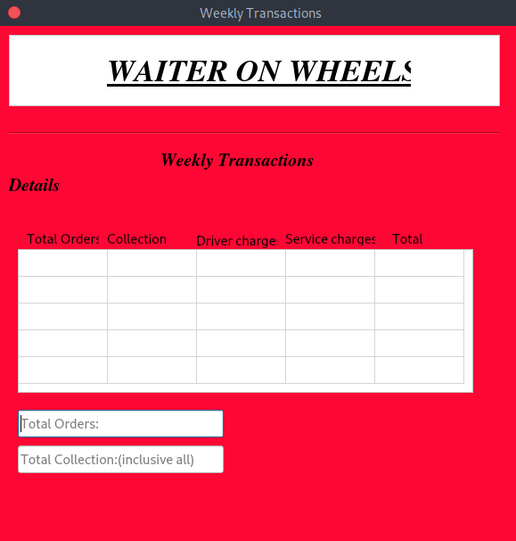
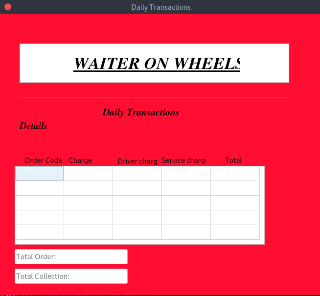
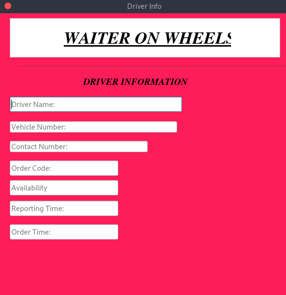
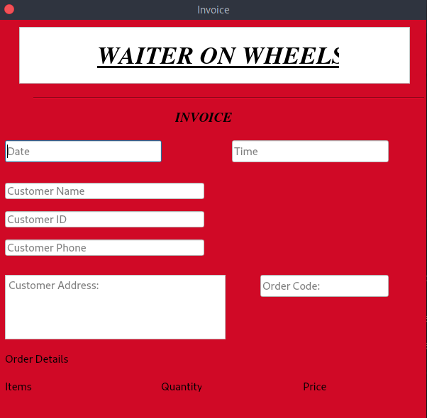
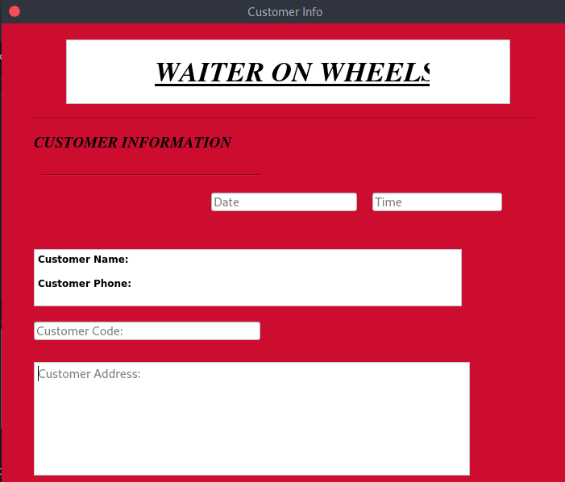

# Waiter on Wheels
> A central restaurant management system that automates the orders and manages the employees, drivers and customers.

## Table of Contents
* [Setup](#setup)
* [Project Status](#project-status)
* [Screenshots](#screenshots)

## Setup
This project requires PyQt5 and pyqrcode to be installed

## Project Status
Project is: _in progress_

## Screenshots

